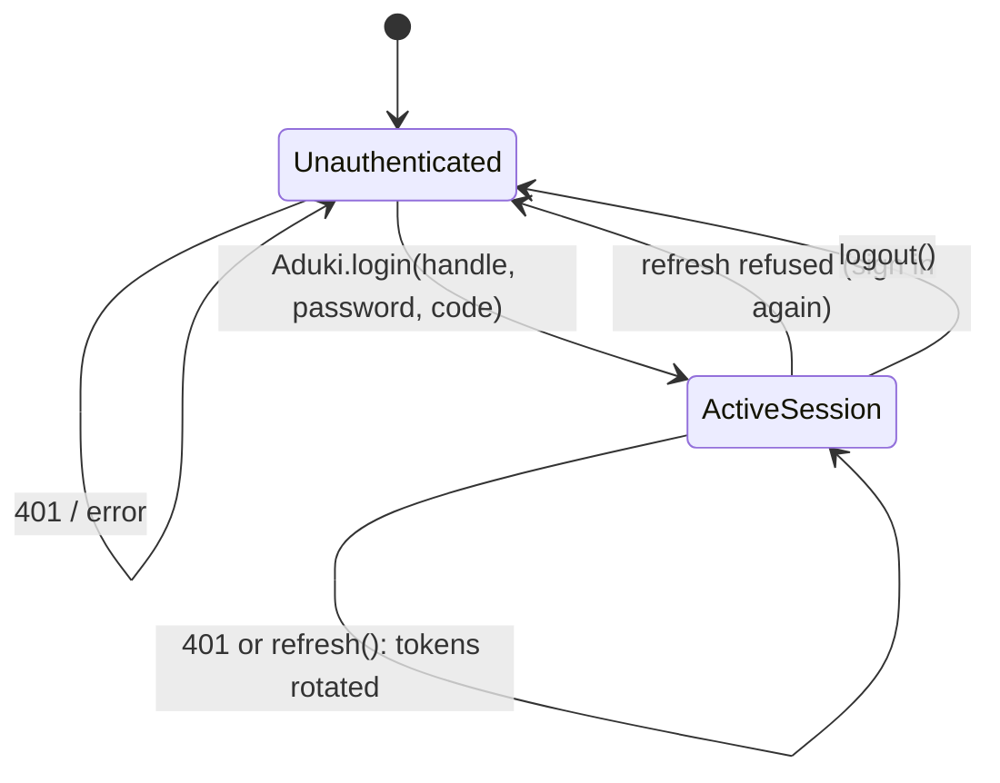

# Authentication Overview

The SDK supports two kinds of credential: a person's sign-in at Aduki ID, and
a static API key for headless clients.

## Credentials

| Property | Interactive sign-in | API key |
| :--- | :--- | :--- |
| Use | apps with human users | workers, tests, daemons |
| Credentials | address + password + second factor, at Aduki ID | a key starting `hm_` or `key_` |
| HTTP header | `Authorization: Bearer <access token>` (`DPoP <token>` when bound) | `Authorization: Key <key>` |
| Lifetime | 10-minute access token (EdDSA JWT per audience), single-use rotating refresh token | until revoked at the server |
| Renewal | automatic on `401` | none |
| Sign-out | `DELETE /v1/sessions/{hex}` at Aduki ID | revoke the key |

Tokens and sessions are held in memory (`client.session`). The SDK does not
write them to disk; persisting the refresh token between launches is up to the
app (restore it with `Id.adopt` or `session.update`).

## In this section

- [Sign-in](login.md): `Aduki.login`.
- [Aduki ID client](id.md): `Id`, one sign-in with many audiences.
- [Token lifecycle](tokens.md): renewal, sign-out, the rights stream.
- [DPoP](dpop.md): binding tokens to a device key.
- [OIDC client](oidc.md): "Sign in with Aduki" for third-party apps.
- [Account Center & unlock](center.md).
- [API keys](keys.md).
- [Two-factor TOTP](totp.md) (deprecated).

## Session lifecycle



## Core types

```kotlin
data class Tokens(
    val token: String = "",    // access token (JWT)
    val refresh: String = "",  // single-use refresh token
    val expires: String = "",  // access-token lifetime in seconds
    val session: String = ""   // Aduki ID session hex, used to sign out
)

data class Identity(
    val user: String = "",
    val tenant: String = "",
    val owner: Boolean = false,
    val scopes: List<String> = emptyList(),  // only if the server returns them
    val tier: String = ""                    // only if the server returns it
)
```

`Identity` is read from mail's `GET /v1/user` by `client.me()`.
