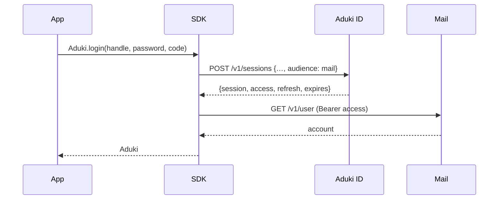

# Sign-in

People sign in at **Aduki ID**, not at mail. The SDK posts the address,
password and second factor to Aduki ID, asks for an access token with audience
`mail`, and sends that token to the mail API as `Authorization: Bearer <token>`.

## `Aduki.login`

```kotlin
suspend fun Aduki.Companion.login(
    handle: String,
    password: String,
    code: String? = null,
    endpoint: String = Endpoints.REST,
    identity: String = Endpoints.ID,
    backup: String? = null,
    dpop: pro.aduki.crypto.dpop.Key? = null
): Aduki
```

| Parameter | Type | Default | Description |
| --- | --- | --- | --- |
| `handle` | `String` | — | Full address, e.g. `ada@aduki.me`. |
| `password` | `String` | — | Account password. |
| `code` | `String?` | `null` | Current authenticator code. |
| `endpoint` | `String` | `Endpoints.REST` | Mail REST base. |
| `identity` | `String` | `Endpoints.ID` | Aduki ID base, `https://id.aduki.pro/v1`. |
| `backup` | `String?` | `null` | A backup code, instead of `code`. |
| `dpop` | `Key?` | `null` | A device key: the session is bound to it ([DPoP](dpop.md)). |

Returns a client holding the access token, the refresh token and the session,
with the account (`me()`) already resolved.

**Throws**

- `AdukiException.Unauthorized`: wrong password, inactive account, or a
  missing or wrong second factor. The message starts with Aduki ID's error
  kind, e.g. `auth.factor: ...` when no second factor was given.
- `AdukiException.Network`: anything else, e.g. `429` while rate-limited
  (`code` holds the status).

## Wire format

```http
POST /v1/sessions HTTP/1.1
Host: id.aduki.pro
Content-Type: application/json

{ "handle": "ada@aduki.me", "password": "…", "code": "123456", "audience": "mail" }
```

```json
{
  "success": true,
  "data": {
    "session": "00000000000000ab",
    "access": "eyJhbGciOiJFZERTQSIs…",
    "refresh": "…",
    "expires": 600
  }
}
```

- `access`: EdDSA JWT for mail, valid `expires` seconds (10 minutes).
- `refresh`: single-use; every renewal returns a new one.
- `session`: the session hex, used to sign out.

These land in `Tokens(token, refresh, expires, session)` on
`client.session.tokens`.

## Flow



## Example

```kotlin
val client = Aduki.login(
    handle = "ada@aduki.me",
    password = password,
    code = "123456"
)
```

Accounts without an authenticator are refused with `auth.factor`; set one up
in Aduki ID's Account Center first.
