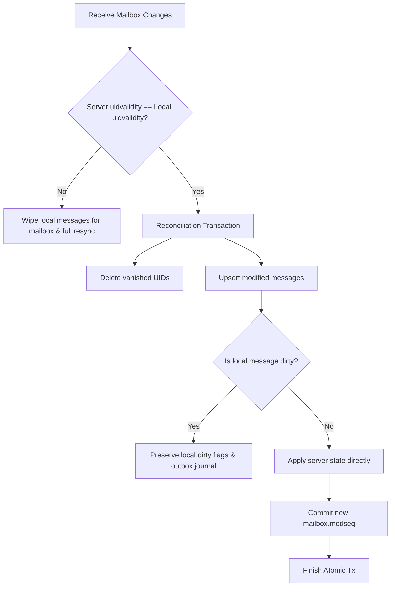

# Sync Service Reference (CONDSTORE / MODSEQ)

The `Sync` service (`client.sync`) orchestrates incremental delta synchronization across email folders and address book contacts using RFC 7162 CONDSTORE / MODSEQ extensions.

---

## 1. Class & Method Signatures

```kotlin
package pro.aduki.sdk

class Sync internal constructor(...) {
    suspend fun all(mailboxes: List<String> = listOf("inbox")): Boolean

    suspend fun flush(): Int

    fun pending(): Int
}
```

---

## 2. Detailed Method Specifications

### `all`
Executes an incremental delta sync across specified mailbox folders and subsequently syncs contacts for the active tenant.

```kotlin
suspend fun all(mailboxes: List<String> = listOf("inbox")): Boolean
```

#### Parameters

| Parameter | Type | Required | Default | Description |
| :--- | :--- | :--- | :--- | :--- |
| `mailboxes` | `List<String>` | No | `listOf("inbox")` | List of mailbox hex identifiers or names to synchronize. |

#### Return Value
- **Type**: `Boolean`
- **Description**: Returns `true` if all targeted mailboxes and the address book synced cleanly; `false` if any mailbox delta failed.

---

### `flush`
Immediately drains all queued offline outbox mutations over the active network transport.

```kotlin
suspend fun flush(): Int
```

- **Return Value**: `Int` — Number of outbox mutations successfully processed and drained.
- **Execution**: Invokes `Worker.drain()`. If network is disconnected or the circuit breaker is open, returns early without throwing.

---

### `pending`
Returns the count of unsynced offline mutations currently queued in the local outbox journal.

```kotlin
fun pending(): Int
```

- **Return Value**: `Int` — Count of pending outbox actions (`send`, `flag`, `move`, `remove`).

---

## 3. Wire Protocol: `GET /v1/user/mail/changes`

`HttpMailboxTransport` (`pro.aduki.sync.http`) implements `MailboxTransport` over the REST face of CONDSTORE/QRESYNC:

```kotlin
val engine = Mailbox(boxStore, HttpMailboxTransport(client.mailApi))
engine.sync(mailboxHex)
```

### HTTP Request

```http
GET /v1/user/mail/changes?mailbox=M0X1A2B3C4D5E6F&since=11500&uidvalidity=1790413341&limit=500 HTTP/1.1
Authorization: Bearer <access token>
```

| Parameter | Meaning |
| :--- | :--- |
| `mailbox` | Mailbox hex. |
| `since` | The MODSEQ from the previous response; `0` for a first sync. |
| `uidvalidity` | The UIDVALIDITY last seen. Omitted on a first sync. |
| `limit` | Page size (default 500, at most 5000). |

### HTTP Response (200 OK)

```json
{
  "mailbox": "M0X1A2B3C4D5E6F",
  "uidvalidity": 1790413341,
  "modseq": 11556,
  "reset": false,
  "more": false,
  "created": [
    {
      "hex": "M0GDB6EC798DDC2F3460", "uid": 4, "subject": "Lunch on Friday?",
      "sender": "bob@example.com", "size": 2048, "flags": [], "thread": "T0X9F8E7D6C5B4A",
      "spam": null, "internaldate": "2026-09-26T09:02:20.658460",
      "preview": "Are you free for lunch on Friday?",
      "from": {"name": "Bob Example", "email": "bob@example.com"},
      "to": [{"name": "Alice", "email": "alice@aduki.test"}],
      "has_attachment": true, "mailbox": {"hex": "M0X1A2B3C4D5E6F", "name": "INBOX"},
      "total": 0, "modseq": 11556
    }
  ],
  "updated": [{"hex": "M0GE32946DDC56C14639", "uid": 2, "flags": ["\\Seen", "\\Flagged"], "modseq": 11553}],
  "vanished": [3]
}
```

- **`created`**: messages new to this mailbox, including ones moved in from another mailbox (they keep their id; the engine reuses the local row).
- **`updated`**: flag changes on messages the client already has.
- **`vanished`**: UIDs expunged or moved away.
- **`more`**: another page waits past `modseq`. `Mailbox.sync` keeps fetching, committing each page, until it is `false`.
- **`reset`**: the client's UIDVALIDITY is stale. The transport refetches from `since=0` and the engine replaces the local copy.
- Timestamps are UTC without an offset.

---

## 4. Reconcile & Merge Algorithm



---

## 5. Data Model: `Sync` Cursor Entity

```kotlin
package pro.aduki.store.entities

import io.objectbox.annotation.Entity
import io.objectbox.annotation.Id
import io.objectbox.annotation.Index

@Entity
data class Sync(
    @Id var id: Long = 0,
    @Index var target: String = "", // e.g. "contacts", "inbox"
    var token: String = "",
    var timestamp: Long = 0
)
```

